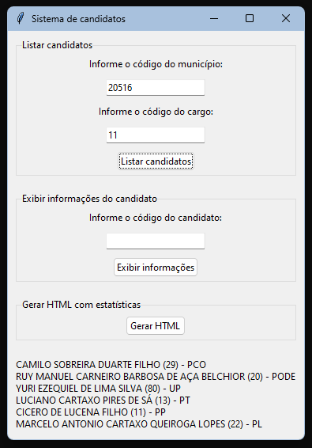

# PROJETO FINAL - ELEIÇÕES 2024

O objetivo deste projeto é aplicar os conhecimentos adquiridos na disciplina de Algorítmos e Programação Estruturada para realizar uma análise nos dados eleitorais de 2024.

